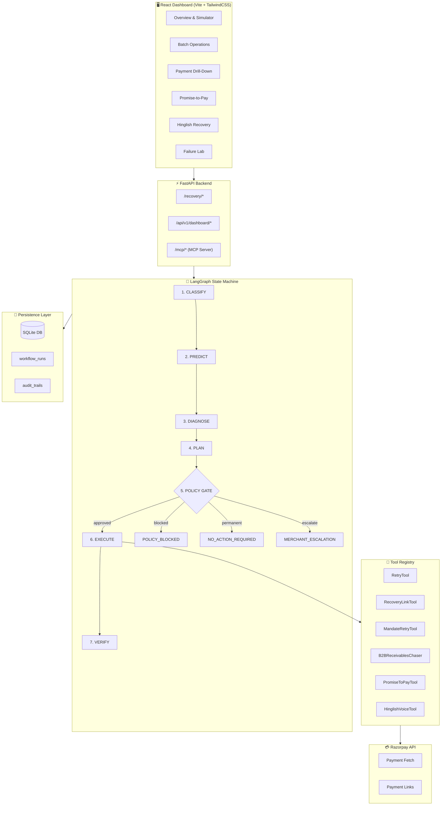
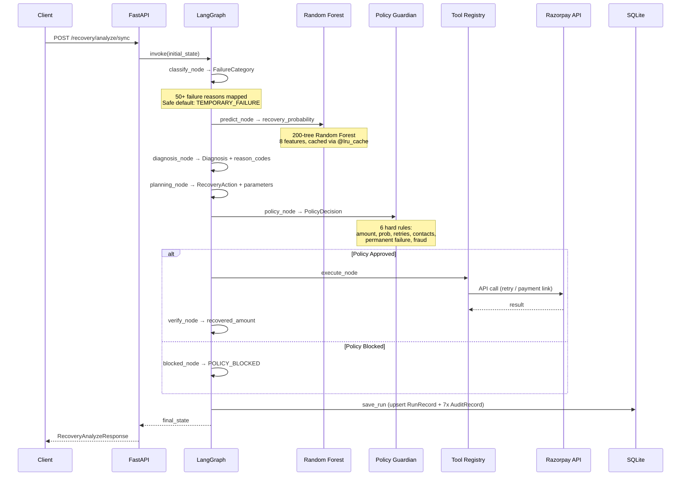
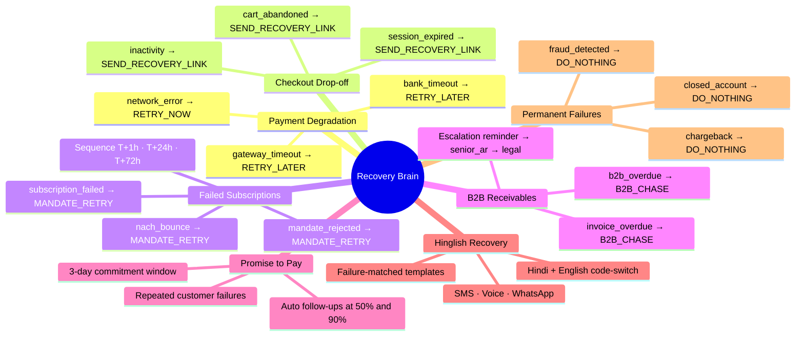
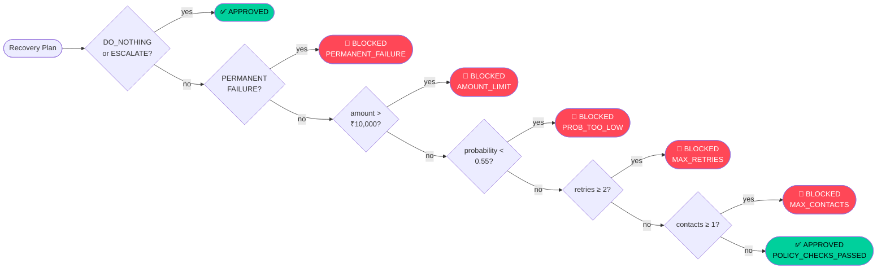
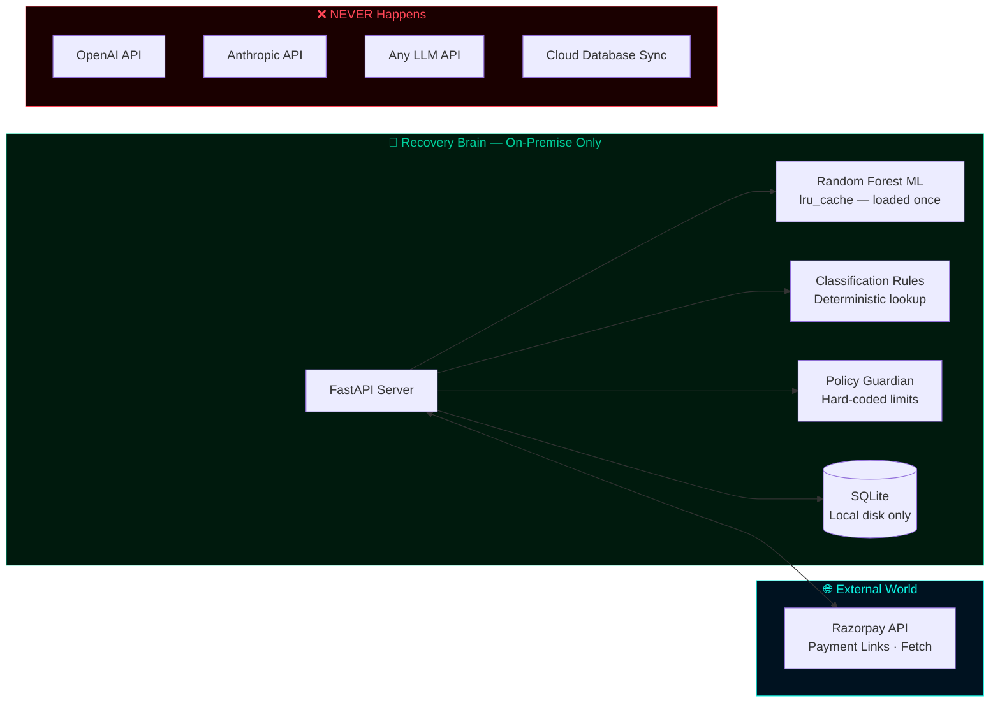
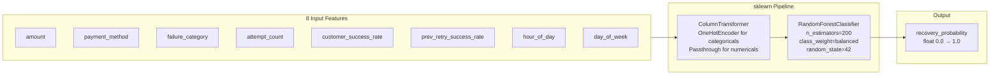

<div align="center">

# 🧠 Razorpay Recovery Brain

### *AI-powered revenue recovery agent for the Razorpay ecosystem*

<br/>

[](https://python.org)
[](https://fastapi.tiangolo.com)
[](https://langchain-ai.github.io/langgraph/)
[](https://react.dev)
[](https://scikit-learn.org)
[](https://razorpay.com)

<br/>

[](https://sqlite.org)
[](https://sqlalchemy.org)
[](https://vitejs.dev)
[](https://tailwindcss.com)
[](https://docs.pydantic.dev)

<br/>

> **Detects** failed payments → **Diagnoses** root causes → **Plans** the right intervention → **Enforces** compliance rules → **Executes** recovery → **Audits** every decision
>
> All on-premise. Zero external AI API calls. Your payment data never leaves your server.

<br/>

</div>

---

## 📌 The Problem

Every second, a payment fails somewhere. A bank timeout. A mandate bounce. A customer who abandoned their cart at checkout. Most merchants find out **three days later — from a spreadsheet.**

| Current Reality | Recovery Brain |
|---|---|
| Retry everything blindly | ML-scored per-payment probability |
| Generic email to every customer | 10 distinct recovery actions matched to failure type |
| No stopping rules | 6 hard policy gates — amount, probability, retry limit, contact limit |
| No audit trail | 7 structured audit events per payment, persisted and queryable |
| Hours to days response time | Under 2 seconds, end to end |
| Payment data sent to external AI | Zero external model API calls — fully on-premise |

---

## 🏗️ System Architecture



---

## 🔄 The 7-Stage Pipeline



---

## 🎯 Recovery Scenarios



---

## 🛡️ Policy Guardian — The Compliance Gate



---

## 🔒 Privacy & Security Architecture



> **Zero external AI calls.** The intelligence layer — ML prediction, failure classification, diagnosis, action planning — runs entirely on your infrastructure. No payment metadata is ever sent to OpenAI, Anthropic, or any third-party model provider.

---

## 📊 Dashboard Pages

| Page | Route | What it shows |
|---|---|---|
| 🖥️ **Overview** | `/` | Live metrics, payment simulator, real-time workflow tracker, recovery funnel chart |
| 📋 **Batch Operations** | `/batches` | All processed payments — searchable, with recovered amounts, policy decisions, actions |
| 🔍 **Payment Drill-Down** | `/batches/:runId` | 7-node animated pipeline, full audit timeline, policy reason codes, execution result |
| ⚡ **Batch Recovery** | `/batch-submit` | Submit up to 100 payments, see aggregate risk / predicted / recovered in real time |
| 🤝 **Promise-to-Pay** | `/promise-pay` | Record payment commitments, view deadline + automated follow-up schedule |
| 🎤 **Hinglish Recovery** | `/hinglish` | Dispatch language-native nudges, preview Hinglish message text |
| 🧪 **Failure Lab** | `/failure-lab` | One-click live demo of the complete 7-stage pipeline |
| 🏗️ **System Architecture** | `/architecture` | 4-zone architecture diagram |

---

## 🚀 Quick Start

### Backend

```bash
# Clone and set up
git clone https://github.com/Suchet0312/RazorPayBuildathon.git
cd RazorPayBuildathon

# Virtual environment
python -m venv .venv
.venv\Scripts\activate        # Windows
source .venv/bin/activate     # macOS / Linux

# Install dependencies
pip install -r requirements.txt

# Configure environment
cp .env.example .env
# → Add your Razorpay test keys (optional — mocks work without them)

# Start server
uvicorn app.main:app --reload --port 8000
```

| URL | What's there |
|---|---|
| `http://localhost:8000/docs` | Swagger UI — all 12 endpoints |
| `http://localhost:8000/health` | Health check |
| `http://localhost:8000/redoc` | ReDoc API reference |

### Frontend

```bash
cd frontend
npm install
npm run dev
# → http://localhost:5173
```

> **Works without Razorpay keys.** The tool registry automatically falls back to mock implementations. All 7 pipeline stages run, all audit events are recorded, all dashboard metrics are real.

---

## 🌐 API Reference

```
GET  /health
POST /recovery/analyze              → async fire-and-forget, returns run_id immediately
POST /recovery/analyze/sync         → synchronous, full result with audit trail
POST /recovery/batch                → batch up to 100 payments, aggregate metrics
GET  /recovery/status/{run_id}      → poll async workflow status
POST /recovery/promise-to-pay       → record payment commitment + follow-up schedule
POST /recovery/hinglish             → dispatch Hinglish SMS / voice / WhatsApp nudge
POST /recovery/simulate-failure     → live demo: bank_timeout on ₹4,999 UPI

GET  /api/v1/dashboard/metrics                        → total_processed, revenue_at_risk, recovery_rate
GET  /api/v1/dashboard/recovery-batches               → all runs, summary list
GET  /api/v1/dashboard/recovery-batches/{run_id}      → full drill-down with audit trail
POST /api/v1/dashboard/demo/simulate-failure          → formatted demo result for UI
```

---

## ⚙️ Policy Constants

```python
MAX_AUTO_ACTION_AMOUNT   = 10_000   # ₹ — above this, escalate to merchant for manual review
MIN_RECOVERY_PROBABILITY = 0.55     # below this, block automated action — not worth the cost
MAX_RETRY_ATTEMPTS       = 2        # per payment — stop hammering a bank that keeps declining
MAX_CUSTOMER_CONTACTS    = 1        # per payment — one message max, no spam
```

---

## 🗂️ Project Structure

```
razorpay-recovery-brain/
│
├── app/
│   ├── agents/                  # 🤖 diagnosis_agent · recovery_planner · policy_guardian
│   ├── api/
│   │   ├── routes/              # ⚡ recovery · dashboard · health
│   │   └── schemas/             # 📐 requests · responses · dashboard schemas
│   ├── core/                    # ⚙️  config · database · logging
│   ├── data/
│   │   ├── generators/          # 🏭 synthetic payment data generator
│   │   ├── synthetic/           # 📊 payments.csv · demo_batch.csv
│   │   └── models.py            # 🗄️  SQLAlchemy ORM (RunRecord · AuditRecord)
│   ├── domain/
│   │   ├── enums/               # 📌 PaymentStatus · FailureCategory · RecoveryAction · AuditStage
│   │   └── models/              # 📦 PaymentRiskRecord · Diagnosis · RecoveryPlan · PolicyDecision
│   ├── integrations/            # 🔌 razorpay_client.py (singleton)
│   ├── intelligence/
│   │   ├── artifacts/           # 🧠 recovery_model.joblib (trained RF)
│   │   ├── classification/      # 🏷️  rules.py — 50+ failure reason mappings
│   │   ├── features/            # 🔧 feature_builder.py — 8 feature dimensions
│   │   └── models/              # 📈 train · predict · evaluate
│   ├── mcp/                     # 🤝 MCP server — 7 tools for AI agent access
│   ├── policies/                # 📜 constants.py — policy thresholds
│   ├── repositories/            # 🗃️  recovery_repository.py — SQLAlchemy upsert
│   ├── services/                # 🔄 recovery · dashboard · promise_to_pay · hinglish
│   ├── tools/                   # 🔧 retry · recovery_link · mandate · b2b · ptp · hinglish
│   └── workflows/               # 🔀 LangGraph: state · graph · nodes · router · verification
│
├── frontend/
│   └── src/
│       ├── pages/               # 8 dashboard pages
│       ├── components/layout/   # Sidebar · Layout
│       ├── services/api.js      # Axios client (dashApi + recoveryApi)
│       ├── PaymentSimulator.jsx # Payment failure form
│       └── WorkflowTracker.jsx  # Live pipeline polling component
│
├── scripts/                     # 🛠️  train_model.py · generate_data.py · inspect_data.py
├── tests/                       # 🧪 unit/ · integration/ · fixtures/
├── .env.example
├── requirements.txt
└── README.md
```

---

## 🧪 ML Model Details



> Model is loaded **once per process** via `@lru_cache(maxsize=1)`. Call `invalidate_model_cache()` after retraining — next request picks up the new artifact automatically.

---

## 🔑 Environment Variables

```bash
# .env.example
APP_NAME=Razorpay Recovery Brain
APP_VERSION=0.1.0
ENVIRONMENT=development

# Optional — system runs on mocks without these
RAZORPAY_KEY_ID=rzp_test_xxxxxxxxxxxx
RAZORPAY_KEY_SECRET=xxxxxxxxxxxxxxxxxxxxxxxx
```

---

## 📈 Numbers at a Glance

<div align="center">

| Metric | Value |
|:---:|:---:|
| Failure reasons mapped | **50+** |
| ML feature dimensions | **8** |
| Random Forest estimators | **200** |
| Recovery actions available | **10** |
| Policy compliance checks | **6** |
| Audit events per pipeline run | **7** |
| REST API endpoints | **12** |
| MCP tools exposed | **7** |
| Dashboard pages | **8** |
| External AI API calls | **0** |

</div>

---

## 🤝 MCP Integration

Recovery Brain exposes **7 tools** over the [Model Context Protocol](https://modelcontextprotocol.io) — making the entire pipeline accessible to any MCP-compatible AI agent (Claude, custom agents, Kiro):

```
run_recovery_workflow       → full 7-stage pipeline
check_recovery_status       → poll run by run_id
fetch_dashboard_metrics     → aggregated revenue metrics
fetch_recovery_batches      → all runs summary
fetch_payment_details       → full drill-down with audit trail
triage_failure              → quick failure classification only
estimate_recovery_probability → standalone ML prediction
```

```bash
# Install MCP support (optional)
pip install 'mcp[cli]'
# Server auto-mounts at /mcp when installed
```

---

<div align="center">

**Built for Razorpay Buildathon · Track 03 — AI Revenue Recovery**

*Find revenue that's slipping away and win it back*

[](https://github.com/Suchet0312/RazorPayBuildathon)

</div>
